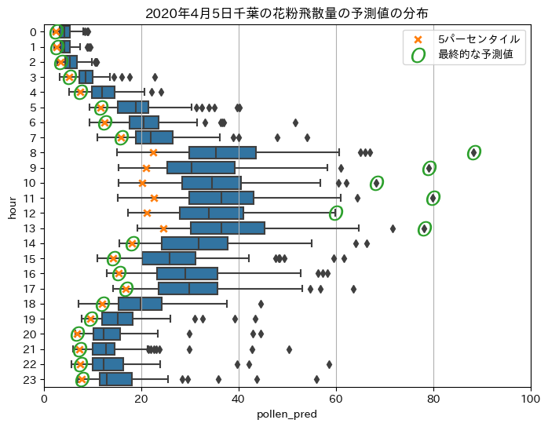

# ProbSpace 花粉コンペ 3rd Place Solution

ProbSpace[「花粉飛散量予測」](https://comp.probspace.com/competitions/pollen_counts)の 3rd place solution です。

## 解法の概要

### 花粉飛散量予測の困難な点

- バリアンスが大きい (少し学習条件を変えただけで予測値が劇的に変わる)。
- 予測が上振れしやすい。
- 花粉飛散量がバーストする。
- 上記問題を特徴量の作り込みで解決できるほど潤沢な情報はコンペのデータには含まれていない。

### 解決方法

- バリアンスが大きい。
  - → バギングでバリアンスを抑えました。
- 予測が上振れしやすい。
  - → バギング時に、予測値の平均値ではなく予測値の5パーセンタイルを最終的な予測値として用いました。
- 花粉飛散量がバーストする。
  - → バギング時に、予測値が全体的に高い時刻に限り最終的な予測値を上方修正しました。

## 解法の詳細

### 特徴抽出

- 降水量・気温・風速
- 降水量・気温・風速の指数移動平均 (半減期：1時間・1日・1週間)
- 2週間前の花粉飛散量の指数移動平均 (半減期：1週間)
- 年・月・時間
- 拠点

※予測対象拠点の天候情報のみ用いました。

### 学習

- モデル
  - LightGBM
- 損失関数
  - 対数変換した `pollen` のRMSE
- ハイパーパラメーター
  - Optunaの `LightGBMTunerCV` で最適化しました。

### アンサンブル

- 学習データからランダムにサンプリングしてデータセットを100個作り、それらのデータセットを用いて予測器を100個作りました。
- 100個の予測値の5パーセンタイルを最終的な予測値として出力しました。
- ただし、花粉飛散量がバーストしていると思われる時刻については、以下の値を最終的な予測値として出力しました。
  - 千葉で5パーセンタイルが20を超えている時刻
    - 100個の予測値の最大値
  - 千葉で5パーセンタイルが27を超えている時刻
    - 2019年以前の4月第1週～第2週の花粉飛散量の99パーセンタイル

※花粉飛散量バースト補正の対象地域や対象時刻はPublic LBのスコアを参考に選びました。

### 後処理

- 予測値を4の倍数に丸めました。
- 負の予測値を0に置き換えました。

### 予測精度の推移

|提出内容|Public LB|Private LB|
|:--|--:|--:|
|バリアンス対策 (バギング)|13.00000|9.65923|
|予測値の上振れ対策 (平均値から5パーセンタイルへの変更)|12.10448|8.85130|
|花粉飛散量バースト補正 (5パーセンタイル20以上・千葉のみ)|11.03980|8.54399|
|花粉飛散量バースト補正 (5パーセンタイル20以上・府中のみ)|12.10448|8.85130|
|花粉飛散量バースト補正 (5パーセンタイル20以上・宇都宮のみ)|12.81095|9.40397|
|花粉飛散量バースト補正 (5パーセンタイル27以上・千葉のみ)|10.08458|8.19703	|

## コード

- [20230109_01.ipynb](./20230109_01.ipynb)
